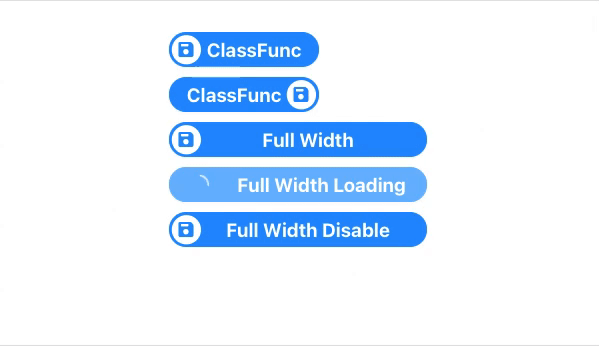

# react-antd-button-svg-icons

> Welcome to ClassFunc. We love to use new technology!

[](https://www.npmjs.com/package/react-antd-button-svg-icons) [](https://standardjs.com)

Demo
link: [https://duongdam.github.io/react-antd-button-svg-icons/](https://duongdam.github.io/react-antd-button-svg-icons/)

Resource: [https://github.com/duongdam/react-antd-button-svg-icons](https://github.com/duongdam/react-antd-button-svg-icons)



## New release 2.3.2

```angular2html
- Use cf-gen-id from : https://www.npmjs.com/package/cf-gen-id
- Fix issue: https://github.com/duongdam/react-antd-button-svg-icons/issues/2
- Remove package react-use, keyboardjs to reduce size, add useHostKey
- New flow to use keyboard + onclick, reduce package size

Ver 2.3.1
- Add new props turn off animated: offAnimated : default "true"
```

## Install

```bash
yarn add react-antd-button-svg-icons
npm install --save react-antd-button-svg-icons
```

## Usage

```js
import { CLFButtonSVG } from "react-antd-button-svg-icons";
```

```js
import React from "react";
import { ReactComponent as TestSVG } from "./test.svg";
import { CLFButtonSVG } from "react-antd-button-svg-icons";
import { message, Typography } from "antd";
import "antd/lib/message/style/css";
import { makeStyles } from "@material-ui/core/styles";

const { Text } = Typography;

const useStyles = makeStyles(theme => ({
  antBtn: {
    background: `red !important`,
    borderColor: `red !important`,
    // textAlign: "left",
    textAlign: "center",
    color: "#fff",
    textTransform: "uppercase",
    display: "flex",
    "& svg": {
      fill: "red"
    },
    "& .ant-btn-block": {
      width: "97%"
    },
    "& .clf-icon-Btn": {
      left: "1px !important"
    }
  }
}));

const App = () => {
  const classes = useStyles();

  return (
    <div style={{
      width: "100%",
      display: "grid",
      maxWidth: "800px",
      // justifyContent: "center",
      // alignItems: "center",
      padding: "100px 50px",
      margin: "100px auto"
    }}>

      With no icon
      <CLFButtonSVG
        name={"私はズオンです。"}
        // name={"ズオ"}
        size={"default"}
        keyboard={["ctrl", "meta"]}
        onClick={(event, keyboard) => {
          if (keyboard)
            return message.success(`This is key + click ${keyboard.toString()}`, 0.2);
          message.success("Hello CLFButtonSVG", 0.2);
        }}
      />

      Default no text
      <CLFButtonSVG
        name={null}
        size={"default"}
        iconComponent={<TestSVG/>}
        onClick={(event, keyboard) => {
          if (keyboard)
            return message.success(`This is key + click ${keyboard.toString()}`, 0.2);
          message.success("Hello CLFButtonSVG", 0.2);
        }}
        disable={false}
      />

      Default
      <CLFButtonSVG
        name={<Text>Default</Text>}
        size={"default"}
        iconComponent={<TestSVG/>}
        onClick={(event, keyboard) => {
          if (keyboard)
            return message.success(`This is key + click ${keyboard.toString()}`, 0.2);
          message.success("Hello CLFButtonSVG", 0.2);
        }}
        disable={false}
        width={"150px"}
      />

      Icon revert right
      <CLFButtonSVG
        name={"ClassFunc"}
        size={"default"}
        iconComponent={<TestSVG/>}
        iconRevert={true}
        onClick={(event, keyboard) => {
          if (keyboard)
            return message.success(`This is key + click ${keyboard.toString()}`, 0.2);
          message.success("Hello CLFButtonSVG", 0.2);
        }}
        disable={false}
        width={"150px"}
        background={"#1790FF"}
        borderColor={"#1790FF"}
      />

      Full Width
      <CLFButtonSVG
        name={"Full Width"}
        size={"default"}
        iconComponent={<TestSVG/>}
        onClick={(event, keyboard) => {
          if (keyboard)
            return message.success(`This is key + click ${keyboard.toString()}`, 0.2);
          message.success("Hello CLFButtonSVG", 0.2);
        }}
        disable={false}
        block={true}
        margin={"5px"}
      />

      With Tooltip
      <CLFButtonSVG
        name={"With tooltip"}
        size={"default"}
        iconComponent={<TestSVG/>}
        onClick={(event, keyboard) => {
          if (keyboard)
            return message.success(`This is key + click ${keyboard.toString()}`, 0.2);
          message.success("Hello CLFButtonSVG", 0.2);
        }}
        disable={false}
        block={true}
        margin={"5px"}
        enableTooltip={true}
        tooltipPlacement={"right"}
      />

      Loading
      <CLFButtonSVG
        name={"Full Width Loading"}
        size={"default"}
        iconComponent={<TestSVG/>}
        disable={false}
        loading={true}
        block={true}
      />

      Disabled
      <CLFButtonSVG
        name={"Full Width Disable"}
        size={"default"}
        iconComponent={<TestSVG/>}
        disable={true}
        loading={false}
        block={true}
        enableTooltip={true}
        tooltipPlacement={"right"}
      />

      Disabled custom with makesTheme
      <CLFButtonSVG
        name={"Full Width Disable"}
        size={"default"}
        iconComponent={<TestSVG/>}
        disable={true}
        loading={false}
        block={true}
        enableTooltip={true}
        tooltipPlacement={"right"}
        className={classes.antBtn}
      />
    </div>
  );
};

export default App;


```

## Prop types

```text
  id: PropType.oneOfType([PropType.string, PropType.number]),
  iconComponent: PropType.element,
  name: PropType.oneOfType([PropType.string, PropType.element, PropType.elementType]),
  onClick: PropType.func,
  size: PropType.string,
  disable: PropType.bool,
  loading: PropType.bool,
  width: PropType.oneOfType([PropType.number, PropType.string]),
  height: PropType.oneOfType([PropType.number, PropType.string]),
  key: PropType.string,
  margin: PropType.string,
  padding: PropType.string,
  block: PropType.bool,
  className: PropType.string,
  minWidth: PropType.oneOfType([PropType.number, PropType.string]),
  minHeight: PropType.oneOfType([PropType.number, PropType.string]),
  color: PropType.string,
  borderRadius: PropType.oneOfType([PropType.string]),
  background: PropType.string,
  borderColor: PropType.string,
  iconRevert: PropType.bool,
  onKeyClick: PropType.func,
  fontWeight: PropType.oneOfType([PropType.string, PropType.number]),
  fontSize: PropType.oneOfType([PropType.string]),
  tooltipPlacement: PropType.oneOf([
    "topLeft",
    "top",
    "topRight",
    "leftTop",
    "left",
    "leftBottom",
    "rightTop",
    "right",
    "rightBottom",
    "bottomLeft",
    "bottom",
    "bottomRight"]),
  tooltipBackground: PropType.string,
  enableTooltip: PropType.bool,
  offAnimated: PropType.bool
```

## Default props

```text
  id: uuidv4(),
  iconComponent: null,
  name: "ClassFunc Button",
  onClick: null,
  size: "default",
  disable: false,
  loading: false,
  key: null,
  margin: "5px",
  padding: "unset",
  block: false,
  className: null,
  width: null,
  height: "auto",
  minWidth: "125px",
  minHeight: "35px",
  fontWeight: 700,
  color: "#FFF",
  borderRadius: "25px",
  background: "#1790FF",
  borderColor: "#1790FF",
  iconRevert: false,
  onKeyClick: null,
  fontSize: "1.2rem",
  tooltipPlacement: "top",
  tooltipBackground: "#1790FF",
  enableTooltip: false,
  offAnimated: true
```

## License

MIT © [duongdam](https://github.com/duongdam)
